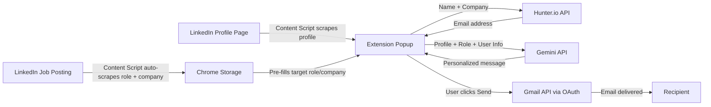

# LinkedIn Outreach Chrome Extension — OutreachAI

> ⚠️ **Educational Purpose Only** — This extension scrapes LinkedIn, which may violate their Terms of Service. Built strictly for learning purposes.

## Overview

Chrome extension that scrapes LinkedIn profiles, auto-detects job context from job postings, finds contact emails via Hunter.io, generates personalized outreach messages via Google Gemini, and sends emails via Gmail — all with one click. Supports both recruiter/hiring manager outreach and general professional networking.

## Design Decisions

| Decision | Choice | Rationale |
|---|---|---|
| Job role detection | Manual fields + auto-scrape from job postings | Seamless when browsing jobs, flexible fallback |
| AI API | **Google Gemini API** | Generous free tier, no cost to start |
| Email sending | **Gmail API + OAuth 2.0** | True one-click send |
| Email lookup | **Hunter.io API** | Auto-find professional emails from name + company |
| User profile | **Configurable Settings page** | Name, background, resume summary, skills — all editable |
| Message tone | **Selectable** (Professional / Semi-casual / Casual) | Flexibility per outreach |
| Outreach mode | **Dual** (Job Application / Networking) | User selects mode, prompt adapts accordingly |
| UI Theme | **Modern dark theme** | Clean, premium feel |

## Pre-Requisites Setup Instructions

### 1. Google Cloud Console (Gmail API + OAuth)
1. Go to [Google Cloud Console](https://console.cloud.google.com/)
2. Create a new project (e.g., "LinkedIn Outreach Extension")
3. Enable **Gmail API**: APIs & Services → Library → search "Gmail API" → Enable
4. Create OAuth 2.0 credentials: APIs & Services → Credentials → Create Credentials → OAuth Client ID
   - Application type: **Chrome Extension**
   - Extension ID: (get this after loading the unpacked extension once)
5. Configure OAuth consent screen: Add `gmail.send` scope

### 2. Gemini API Key
1. Go to [Google AI Studio](https://aistudio.google.com/)
2. Click "Get API Key" → Create key
3. Copy the key — you'll paste it in the extension's Settings page

### 3. Hunter.io API Key
1. Sign up at [Hunter.io](https://hunter.io/)
2. Free plan: 25 searches/month
3. Go to API → Copy your API key

---

## Architecture



---

## File Structure

```
linkedin-outreach-extension/
├── manifest.json              # Manifest V3 config
├── icons/
│   ├── icon16.png
│   ├── icon48.png
│   └── icon128.png
├── content/
│   ├── profile-scraper.js     # Scrapes LinkedIn profile data
│   └── job-scraper.js         # Scrapes job posting data
├── popup/
│   ├── popup.html             # Main extension UI
│   ├── popup.css              # Modern dark theme
│   └── popup.js               # Orchestration logic
├── options/
│   ├── options.html           # Settings page
│   ├── options.css            # Settings theme
│   └── options.js             # Save/load settings
├── utils/
│   ├── ai.js                  # Gemini API + dual prompt templates
│   ├── hunter.js              # Hunter.io email finder
│   └── gmail.js               # Gmail send helper
└── background/
    └── service-worker.js      # OAuth + Gmail proxy
```

---

## Components

### Content Scripts

- **profile-scraper.js** — Scrapes LinkedIn profile pages: name, headline, about summary, experience, education, skills, accomplishments. Sends data to popup via `chrome.runtime.sendMessage`.
- **job-scraper.js** — Scrapes LinkedIn job posting pages: job title, company name, job description excerpt. Auto-saves to `chrome.storage.local`.

### Popup UI (Dark Theme)

- **popup.html** — Main extension UI with scraped profile data, outreach mode toggle (Job Application / Networking), editable fields, generated message preview, email field (with Hunter.io auto-fill), Generate & Send buttons.
- **popup.css** — Modern dark theme: dark backgrounds (`#1a1a2e`, `#16213e`), accent gradients (blue-purple), smooth transitions, glowing focus states, card-based layout.
- **popup.js** — Orchestrates: load scraped data → Hunter.io email lookup → Gemini message generation → Gmail send. Handles loading states, error display, clipboard copy.

### Settings Page

- **options.html/css/js** — Settings page with sections: API Keys (Gemini, Hunter.io), Gmail OAuth connection, User Profile (name, current role, company, education, skills, resume summary — all editable). Saves to `chrome.storage.sync`.

### Utility Modules

- **ai.js** — Gemini API integration with dual prompt templates:
  - **Job Application mode**: Appreciation → Self-intro → Position interest → Ask for referral/guidance
  - **Networking mode**: Appreciation → Self-intro → Common ground → Ask for connection/advice
- **gmail.js** — Gmail API helper: compose RFC 2822 email, send via `gmail.users.messages.send`.
- **hunter.js** — Hunter.io API integration: `email-finder` endpoint — takes first name, last name, company domain → returns professional email.

### Background

- **service-worker.js** — Handles OAuth 2.0 token flow via `chrome.identity.getAuthToken`, proxies Gmail API calls.

---

## How to Load & Test

1. **Load extension**: Go to `chrome://extensions` → Enable Developer Mode → Load Unpacked → select the `linkedin-outreach-extension` folder
2. **Settings**: Click extension icon → gear icon → enter your Gemini API key, Hunter.io API key, and your profile info → Save
3. **OAuth**: Click "Connect Gmail" in settings → complete Google sign-in flow
4. **Profile scrape**: Visit any LinkedIn profile → click extension icon → verify name, headline, and details populate in the popup
5. **Job scrape**: Visit a LinkedIn job posting → extension auto-detects role + company → open popup on a profile and verify fields pre-fill
6. **Email lookup**: With a profile loaded, click "Find Email" → verify Hunter.io returns a result
7. **Message generation**: Click "Generate Message" → verify the AI-generated message is personalized and follows the template structure
8. **Email send**: Enter your own email as recipient → click "Send Email" → verify you receive it in your inbox

> **Note:** All API integrations use dummy data fallbacks when no API keys are configured. You can test the full UI flow without any real keys — dummy emails, dummy messages, and console-logged sends will work out of the box.

---

## APIs Used

| API | Purpose | Setup |
|---|---|---|
| **Google Gemini API** | Message generation | API key from [Google AI Studio](https://aistudio.google.com/) |
| **Hunter.io API** | Email lookup | API key from [Hunter.io](https://hunter.io/) |
| **Gmail API** | One-click email send | OAuth 2.0 via [Google Cloud Console](https://console.cloud.google.com/) |
| **Chrome APIs** | Storage, tabs, scripting, identity | Built-in |

---

## License

Educational use only. Not intended for production or commercial use.
